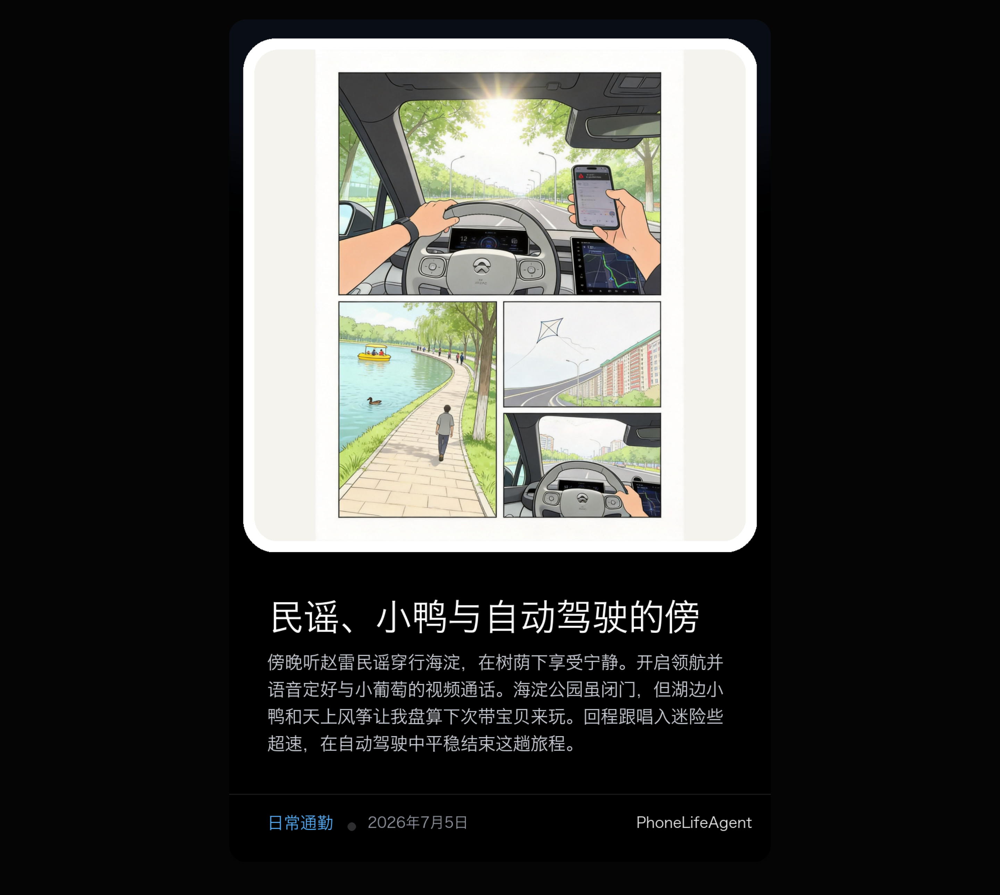
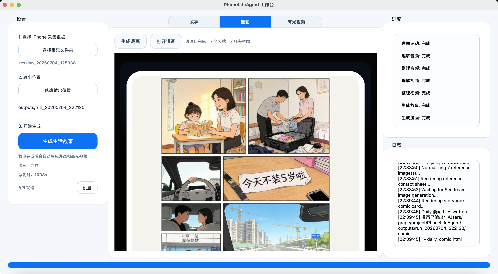

# 【PhoneAI】：把 iPhone 挂在脖子上，能得到什么？

上篇我们聊到，iPhone 是一个很好的多模态实验平台，可以直接拿来验证 Always On 设备的底座能力。这一篇，我把 iPhone 挂在脖子上，看看一段时间下来到底能沉淀出什么。

最近一两年 Always On 设备层出不穷，从 AI 眼镜、挂在胸前的 Looki，到各种 AI 音频硬件。一个 Lifelong Agent（终身智能体）。它长期和我共享同一个视角，听我所听，看我所看，逐渐理解我的生活习惯、偏好和判断方式，最后长成一个真正有连续性的数字分身，超越人类的智慧。

要实现这样的 Agent，稳定的数据入口和把原始生活数据清洗成记忆的能力缺一不可。这次我做了一个初步雏形，尝试复刻类似Looki L1 的核心能力：把一整天的流水数据压缩、提取并整理成故事线、漫画和高光视频。

目前代码已开源，感兴趣的朋友可以直接去看：

- GitHub: [PhoneLifeAgent](https://github.com/ydsf16/PhoneLifeAgent)
- Tag: `release/story_comic_video`

### Story

这是最终整理出来的一天故事页，包含路线、时间线和长期值得记住的信息。

### Comic

这是基于真实故事线和参考图重绘出来的一张漫画卡片。

### Highlight Video

这是从真实视频片段里剪出来的一段高光回放。

<video src="docs/blog_assets/highlight_video_example.mp4" controls muted playsinline width="480"></video>

## 1. 技术实现：从原始数据到“人类记忆”

### 设备端如何优雅地记录数据？

对于 Always On 设备，24 小时不间断录制并不合适，功耗和存储都扛不住。理想状态应该是设备主动记录、抓取真正有价值的信息，交互方式可以很多，语音、手势、震动都只是其中的一部分。不过在第一个版本里，我用了更简单直接的间隔录制法：

- 视频：每隔 1 分钟，自动录制 10 秒
- 音频：连续录制
- 定位：1Hz 连续采集
- 运动（IMU）：1Hz 连续采集

通过这四类数据，我们就能基本还原出一个人一天经历的现实世界。

### 多模态理解层

理想情况下，我们希望有一个大一统的多模态模型能把所有信息一把吞下。但现阶段模型还没进化到这一步，所以我采用了“专家模型分工 + 后期合成”的架构。

#### 运动

大模型不能直接读懂原始 IMU 信号，所以我先做一层前处理，把它转成可理解的文本标签，比如：

- 静止
- 平稳走路
- 剧烈运动

这样模型就知道你是在静止，还是在匆匆赶路。

#### 空间定位

定位是很重要的一条信息线。我通过 GPS 加高德 API，把经纬度转成 POI、道路、空间上下文。如果未来加上室内 VPS，这条空间线会更完整。之后也能支持基于位置/场景信息的主动式服务等功能。

这些位置信息会把“小区、公园、便利店、路口、回家”这类零散片段串成一条真实路径。

#### 视频 + 音频合流

视频片段会结合音频、定位、运动一起理解。处理视频时，我会把当时的运动状态和位置上下文注入进去，让模型带着背景知识去读画面。

#### 音频

音频部分使用 Qwen Audio / Omni。它不仅能识别对白，也能理解环境音。脚步声、雨声、收付款提示音、挪车时的喊声，这些声音本身就在塑造故事的气质。

### 记忆合成层与输出层

当各模态中间产物完成之后，系统会把这些证据汇总，先生成结构化的：

- `life_story.json`
- `life_story.md`

然后再生成最终给人看的产物：

- Story HTML
- Comic 页面与图片
- Highlight Video 页面与视频

这一步的关键，是把原始证据消化掉，最后留下一个可读、可看、可回放的“记忆版本”。

#### Story 是怎么生成的？

Story 是整个流程的第一层最终产物。系统会先把音频、视频、定位、运动四路信息整理成统一的证据包，再交给大模型做一次整体合成。

这里面有几个关键点：

- 音频给出环境声音、说话内容和情绪氛围
- 视频给出场景、人物动作、关键事件和可用关键帧
- 定位把这些片段串到真实空间路径上
- 运动让模型知道你是在静止、步行、转身还是快速移动

最后模型会产出一版结构化故事线，再渲染成给人看的 Story 页面。页面里展示的是整理后的结果，不直接把后台证据原样堆给用户。

#### Comic 是怎么生成的？

漫画不是直接把整天数据一次性丢给模型生一张图，那样很容易乱。现在的做法是先基于 Story 提炼分镜，再回到原始视频里找每个分镜最合适的真实参考图。

大致流程是：

- 先根据 Story 生成漫画故事线和分镜规划
- 每个分镜只选一张最匹配的真实参考图
- 把这些参考图按顺序交给生图模型
- 最后生成一整张统一风格的漫画页

这样做的好处是，故事顺序更稳，关键场景更贴近真实数据，画风也能统一。当前版本里，漫画更像是对真实生活片段做一次风格迁移和重绘，而不是凭空编故事。

#### Highlight Video 是怎么生成的？

高光视频也不是让模型直接生成视频，而是先从已经理解过的视频片段里做一次“挑选和剪辑”。

具体来说：

- 先从 Life Story 里提取高光故事线
- 再从真实视频片段里挑选最匹配的几个 clip
- 每个 clip 截取一个最合适的时间段
- 最后用 ffmpeg 拼接成 30 到 60 秒左右的短视频

上面这套流程现在也已经接进桌面 GUI 里，可以直接选 iPhone 采集数据、指定输出目录，然后一键生成 Story、Comic 和 Highlight Video。

## 2. 这件事在 Lifelong Agent 版图里的位置

这次做出来的 Story、Comic、Highlight Video，Lifelong Agent 里，属于最底层、也最关键的一层：整理记忆。

一个真正长期陪伴人的 Agent，大致会往这个方向演进：

主动感知 -> 整理记忆 -> 长期积累 -> 检索问答 -> 工具调用 -> 主动服务 -> 持续学习

当“一天”的数据可以被压缩成一段像样的结构化记忆后，后面的事情才真正有了落点：

- 多天、数周的数据怎么串联
- 常去地点和重复习惯怎么抽出来
- 生活里的细微变化怎么被察觉
- 工具该在什么时机被主动调用

当然目前还是很粗糙的起点，真正的记忆要考虑做LifeLong的Meomery系统，这个目前也是大家研究的热点。其实本质是一个结构化的存储，以及如何合理的加载进入大模型的上下文。目前做memroy的两个思路一个是更新权重、一个是维护好上下文。我们属于上下文的路子。

