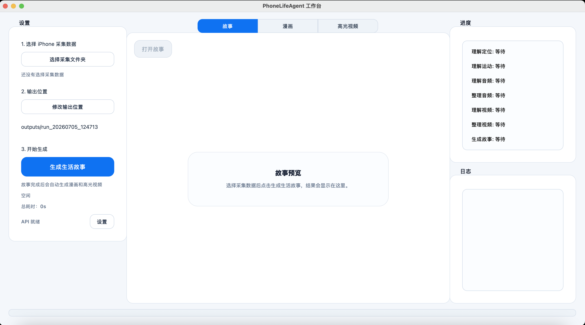

# PhoneLifeAgent

PhoneLifeAgent 把 iPhone 采集到的音频、视频、定位和运动数据，整理成可读、可看、可回放的一天记忆。

当前产物：

- Story
- Comic
- Highlight Video

详细介绍见：

- [BLOG.md](BLOG.md)

## Repo 结构

```text
apps/ios_lifelogger/     iPhone 采集端 LifeLogger
apps/desktop_studio/     macOS 桌面 GUI
life_report/             核心离线 pipeline
docs/blog_assets/        博客配图
tests/                   测试
```

## 环境准备

### 1. 安装 Python 依赖

在 macOS Terminal 里执行：

```bash
cd /Users/grape/project/PhoneLifeAgent
python3 -m venv .venv
source .venv/bin/activate
python -m pip install --upgrade pip
pip install -e ".[desktop,aliyun]"
```

安装完成后，执行：

```bash
cd /Users/grape/project/PhoneLifeAgent
source .venv/bin/activate
python -c "import PySide6, openai, PIL, numpy; print('PhoneLifeAgent deps ready')"
```

终端打印 `PhoneLifeAgent deps ready`，说明依赖安装完成。

### 2. 准备账号和 Key

桌面 GUI 里需要配置这些：

- 阿里 DashScope API Key
- 阿里 DashScope OpenAI-compatible Base URL（选填，默认会自动使用 DashScope 官方兼容地址）
- 高德 / Amap API Key
- Seedream / Ark API Key

对应能力：

- DashScope：音频、视频、Story、Comic 规划、Highlight 规划
- Amap：定位增强、路线图
- Seedream / Ark：漫画生图

## 使用步骤

### 第一步：在 Mac 上安装并运行 LifeLogger

LifeLogger 在：

- [apps/ios_lifelogger/README.md](apps/ios_lifelogger/README.md)

最短路径：

```bash
cd apps/ios_lifelogger
open LifeLogger.xcodeproj
```

然后在 Xcode 里：

- 连接你的 iPhone
- 配好签名
- Build 并安装 `LifeLogger`
- 打开 App 开始采集

采集结束后，把整个 `session_YYYYMMDD_HHMMSS` 目录从 iPhone 导出到 Mac。


### 第二步：在 GUI 中导入数据并生成结果

启动桌面 GUI：

```bash
cd /Users/grape/project/PhoneLifeAgent
source .venv/bin/activate
python apps/desktop_studio/main.py
```

执行后会打开：

- `PhoneLifeAgent 工作台`

GUI 里的操作顺序：

1. 点“选择采集文件夹”，选中一个 `session_YYYYMMDD_HHMMSS`
2. 点“修改输出位置”，指定输出目录
3. 点“设置”，填好：
   - 阿里 DashScope Key
   - 阿里 DashScope Base URL（可留空）
   - 高德 Key
   - Seedream / Ark Key
4. 点“生成生活故事”

生成完成后，GUI 会自动继续产出：

- Story
- Comic
- Highlight Video



结果默认会写到 `outputs/` 下的一个新 run 目录，例如：

```text
outputs/run_20260704_124922/
  story/
  comic/
  highlight_video/
  location/
  motion/
  audio/
  video/
```

## 最短启动路径

项目拉到本地后，执行下面 5 行：

```bash
cd /Users/grape/project/PhoneLifeAgent
python3 -m venv .venv
source .venv/bin/activate
pip install -e ".[desktop,aliyun]"
python apps/desktop_studio/main.py
```

## 常用命令

### 跑完整 session pipeline

```bash
python -m life_report run-session \
  --session /path/to/session_YYYYMMDD_HHMMSS \
  --output outputs/run_test \
  --provider aliyun \
  --use-amap
```

## 说明

- `outputs/` 是本地生成产物目录，不建议提交大批量 run 数据
- 当前主入口是桌面 GUI，不再维护旧的 Streamlit demo 流程
